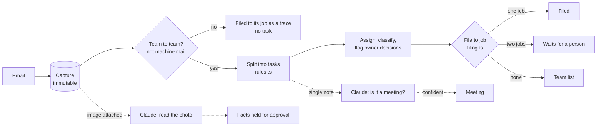

# ops-intake

A contractor's inbox turned into filed, assigned work, with the model kept to the places where a mistake is cheap to catch.

This is the core of an operations platform I built and run for a Dallas general contractor, rewritten here as a standalone module with a fictional company (Oakline Builders) so the design can be read in public. The production system is private; its numbers are below.

## The idea

An owner of a small construction company runs the business from his inbox. At the end of the day he emails himself a list: order the tile, swap the dumpster, call the client about the change order. Vendors send quotes, the office sends calendar invites, a leak gets reported at 7am. All of it lands in one place and none of it is filed.

The obvious build is to hand every email to an LLM and let it decide what to do. That fails in the one place it matters. Filing a note against the wrong job corrupts that job's history, and nobody notices until a client asks why their kitchen has someone else's plumbing on it. An unfiled note is visible. A misfiled one is not.

So the pipeline is split by the cost of being wrong:

| Decision | Made by | Why |
|---|---|---|
| Is this the team's own work, or correspondence? | Rules | A task list full of vendor mail is worse than a short true one |
| Which job is it for? | Rules, whole word alias match, refuses to guess | Misfiling is silent and corrupting |
| Who is it for? | Rules, a leading name delegates | Predictable for the people being assigned |
| Does the owner have to decide this? | Rules: money, scope, unhappy clients | The delegation boundary has to be explainable |
| Is this note also a meeting? | Claude, structured output, confidence 0.8 or above | Judgment needed; a wrong guess is a calendar entry someone deletes |
| What does this photo of a check say? | Claude, vision, structured output | Judgment needed; facts are held for a person to approve, never booked |



## In production

The private system this comes from has run since the end of July 2026 for a remodeling company in Dallas. As of October 5, 2026:

- 686 inbound messages through the pipeline (653 email, 33 from the JobTread project management API)
- 132 action items extracted, 78 percent closed
- 74 of the 76 job related items filed to the right job with no human sorting (97 percent); the other 2 were filed by a person
- 16 items stopped at the owner instead of being acted on
- Supabase Postgres, 16 Deno edge functions, 72 row level security policies across eight roles

The pipeline is also how new features arrive. On October 2 the office manager lost an afternoon to a change agreed on site with nothing written down. By October 5 the owner could record the walkthrough on his phone; Deepgram transcribes it, Claude writes the recap onto the job, and the team sends it to the homeowner so both sides hold the same record. Same shape as everything above: the model does the reading, a person decides what goes out.

## Run it

```bash
npm install
npm run demo                    # rules only, no network, no key
npm run demo -- --with-claude   # adds meeting detection; needs ANTHROPIC_API_KEY
npm test                        # 25 tests, including the schema against real Postgres (PGlite)
```

```
m1  "Alder tomorrow"
  [Marcus] Order the tile for the primary bath  (material)  ->  4412 Alder Ave remodel
  [team] Confirm dumpster swap Thursday  (material)  ->  4412 Alder Ave remodel
  [team] Call the client about the change order on the vanity  (owner decides)  ->  4412 Alder Ave remodel

m2  "Hollis"
  [team] Water stain under the sink at Hollis, looks like the supply line is leaking  (issue, URGENT)  ->  Hollis kitchen

m4  "Pull the permit card"
  [team] Pull the permit card  ->  needs a person (4412 Alder Ave remodel or Ridge Rd addition)

m5  "Your quote for Alder Ave"
  outside or machine mail: kept on file, no task  ->  4412 Alder Ave remodel

m1  "Alder tomorrow"
  already ingested, skipped
```

## What's where

| | |
|---|---|
| [src/rules.ts](src/rules.ts) | Which mail is work, splitting a note into tasks, delegation by name, owner decisions |
| [src/filing.ts](src/filing.ts) | Job filing that refuses to guess |
| [src/extract.ts](src/extract.ts) | Claude for meetings and photos, via structured outputs, behind an interface the pipeline can run without |
| [src/pipeline.ts](src/pipeline.ts) | One email in: idempotent on message id, rules first, model second |
| [schema/001_ops.sql](schema/001_ops.sql) | Postgres: immutable captures, the same filing rule in SQL, row level security by role, only the owner settles an owner decision |
| [test/](test/) | The rules, the pipeline with a stubbed model, and the schema as an ordinary database role |

## Choices worth defending

- **Captures are immutable; items are interpretations.** The email is what was said. The task is what we think it means. Re-reading a capture when a rule improves never loses the original.
- **The filing rule exists once in SQL.** Live ingest, a backfill and an alias edit in the app all call the same function, so they cannot disagree about where a note belongs.
- **Ambiguity is a state, not an error.** "Permit at Alder and Ridge" names two jobs and waits for a person. Guessing would be faster and wrong half the time.
- **The model is optional.** `NoExtractor` runs the whole pipeline with no network. A failed or refused model call leaves the note as a plain task; it never blocks ingest.
- **Money is never written by a model.** Receipt and check facts are stored as `needs_approval`. A person books the cost.
- **Security lives in the database.** Crew see the jobs they are on, raw mail is office only, and the owner decision guard is a trigger, so no client code can route around it.

Built by [Jeffrey Mailey](https://github.com/jmailey23), [Jump Automations](https://jumpautomations.com).
